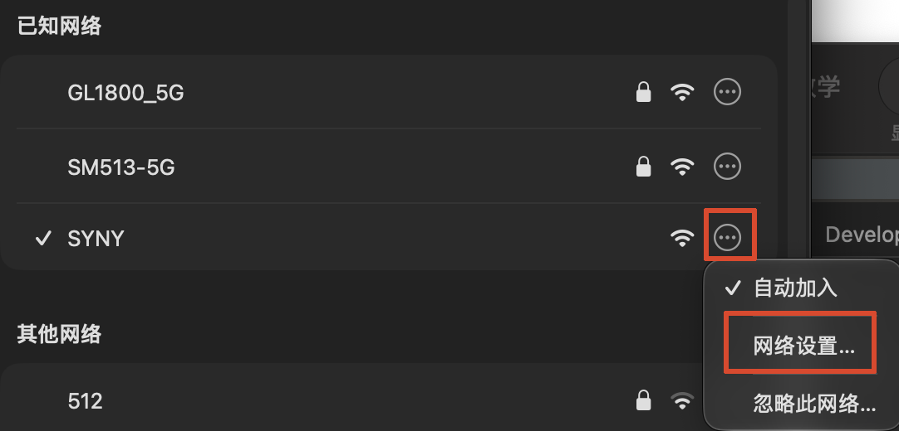
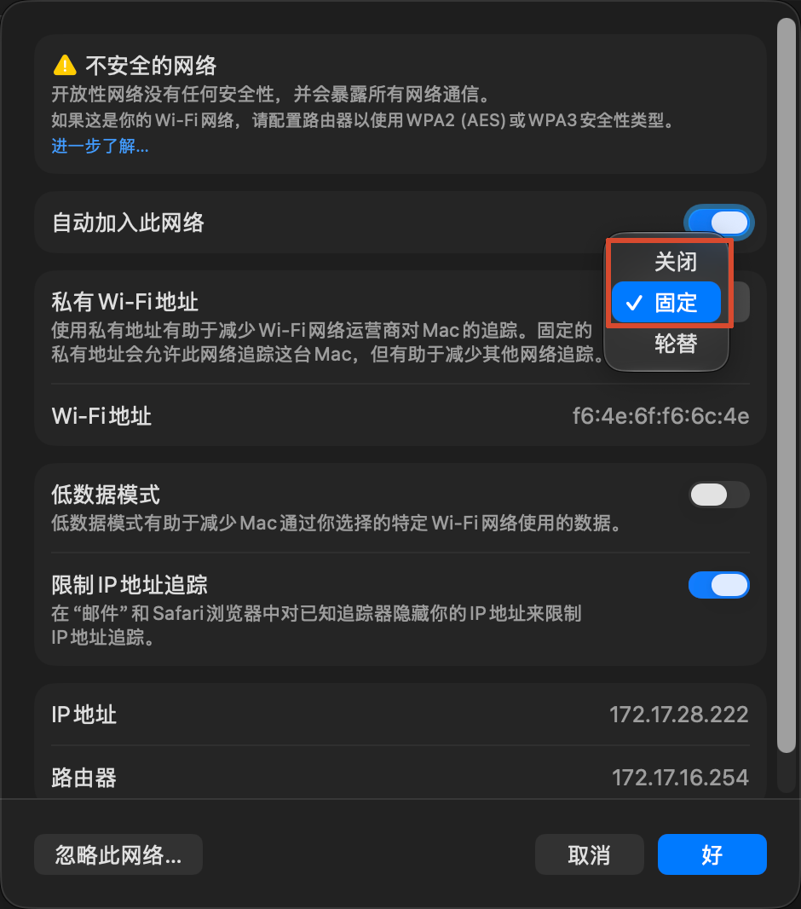

# SYNY 校园网自动认证

[](https://github.com/luyiheng1111/MacAutoSYNY/releases/tag/v2.2.0)
[](https://github.com/luyiheng1111/MacAutoSYNY/releases)
[](https://github.com/luyiheng1111/MacAutoSYNY/releases)

macOS 菜单栏小工具，自动登录 **嘉兴南洋职业技术学院** 的锐捷 eportal 校园网。
连上 `syny` 开头的 WiFi 后，无需再手动打开认证页输账号密码——后台会自动探测、自动认证。

> 纯 Swift 实现，安装包内 **不含任何 Python 运行时**，Mac 用户开箱即用。

---

## 功能特性

- **自动认证**：连上校园网后自动完成锐捷 eportal 登录，断网/切换网络后自动重连。
- **菜单栏常驻**：图标常驻屏幕右上角，不占用程序坞（Dock）。
- **开机自启**：开启后台认证后，重启电脑会自动在后台运行，无需手动打开。
- **手动控制**：可在图形界面或命令行手动触发一次认证 / 立即下线。
- **状态可视**：随时查看当前配置、校园网判定依据、门户会话有无。
- **密码安全**：账号密码保存在 macOS 系统钥匙串（Keychain），不落地明文。
- **新手引导**：首次启动自动弹出「改 Wi-Fi 设置」图文教学（「私有 Wi-Fi 地址」需设为
  「固定 / 关闭」），面板里可随时重看。
- **零 Python 依赖**：后端、守护进程、GUI 全部原生 Swift，单可执行文件五合一。

---

## 系统要求

- macOS 13.0（Ventura）及以上
- Apple 芯片（M1 / M2 / M3 / M4）
- 仅针对嘉兴南洋职业技术学院校园网（锐捷 eportal）适配

---

## 安装

1. 前往 [Releases](https://github.com/luyiheng1111/MacAutoSYNY/releases) 下载 `SYNY-<版本>.dmg`；
2. 打开 DMG，把 **SYNY** 拖到右侧的 **应用程序** 文件夹；
3. 首次打开会被 Gatekeeper 拦截（本工具未购买 Apple 开发者签名证书），这是正常的系统安全机制：
   - **macOS 15 (Sequoia) 及以上**：双击触发拦截后，进入「系统设置 → 隐私与安全性」，点「仍要打开」（该按钮在拦截后约 1 小时内出现，找不到就重新双击一次 SYNY 再回来找）。
   - **macOS 14 (Sonoma) 及更早**：在「应用程序」里按住 Control 键点 SYNY，选「打开」。
4. 若提示「SYNY 已损坏，无法打开」，在终端执行：
   ```sh
   xattr -dr com.apple.quarantine /Applications/SYNY.app
   ```
   再重新打开即可。

---

## ⚠️ 必做：先把「私有 Wi-Fi 地址」改成「固定」

> SYNY **首次启动会自动弹出这份教学**。这里是同样的内容，方便随时回看
> （面板上也有「WiFi 设置教学」按钮可以重开）。

**为什么必须改**：macOS 的「私有 Wi-Fi 地址」出厂默认是 **轮换** —— 每连一次网就换一个随机
MAC 地址发给路由器。而校园网认证门户是**按 MAC 地址记住「这台设备已登录」**的：
MAC 一变，门户就把它当成新设备，要求重新认证。

表现就是：**明明装了 SYNY，还是老弹认证页，或者刚登上就掉线。**
把它设为「固定」，MAC 稳定下来，一次认证即可长期有效。

**第 1 步**：点菜单栏右上角的 Wi-Fi 图标，在「已知网络」里找到校园网（`SYNY`），
点它右侧的 `⋯` 按钮 → 选「**网络设置…**」。
（从「系统设置 → Wi-Fi → 详细信息」进去是同一处。）



**第 2 步**：在详情页把「**私有 Wi-Fi 地址**」从「**轮换**」改为「**固定**」（推荐）
或「**关闭**」，点右下角「**好**」保存。



补充：

- 改完把 Wi-Fi **断开再连一次**，让新的地址立刻生效；
- 「固定」与「关闭」效果等价（都能让 MAC 稳定）；若「固定」之后仍反复要求认证，
  改用「关闭」再试一次；
- 若学校门户此前已按旧 MAC 绑定过，改完第一次可能需要重新登录一次，属正常现象。

这一步只能手工做：修改 MAC 地址需要管理员权限，且该开关不开放给程序调用，
SYNY 无法代劳。

---

## 使用

1. 打开 SYNY，菜单栏（右上角）出现图标；
2. **首次启动会弹出「修改 Wi-Fi 设置」教学，请按它把「私有 Wi-Fi 地址」设为「固定」或「关闭」**（见上一节）；
3. 若系统弹出「SYNY 想要查找并连接到本地网络上的设备」，请点 **允许**（校园网认证需要本地网络权限）；
4. 点菜单栏图标，填写校园网账号和密码，点 **保存并启用后台认证**；
5. 完成。之后连上 `syny` 的 WiFi 即自动登录。

---

## 命令行工具

`SYNY.app/Contents/MacOS/SYNY` 是同一份可执行文件，兼具 GUI 与命令行能力，
便于在图形界面之外排查问题：

| 命令 | 作用 |
| --- | --- |
| `SYNY` | 打开菜单栏设置界面（默认） |
| `SYNY daemon` | 前台运行后台认证循环（launchd 即以此方式托管） |
| `SYNY test` | 立即执行一次「探测 + 认证」并输出结果 |
| `SYNY logout` | 手动下线（注销门户会话），并说明到底有没有会话可注销 |
| `SYNY status` | 查看配置、校园网判定依据与后台服务状态 |
| `SYNY -h` | 查看帮助 |

示例：

```sh
# 查看当前状态（校园网判定 + 门户会话一目了然）
/Applications/SYNY.app/Contents/MacOS/SYNY status
```

---

## 工作原理

- **探测**：定时请求 `http://captive.apple.com/hotspot-detect.html` —— 这与 **macOS
  自带登录页（CNA）使用的探测地址相同**，所以本软件的判定口径与系统一致：我们
  看到 `Success`，系统那次探测也会通过，不会再弹出系统登录页。若请求被网关劫持到
  认证页，则说明需要认证。探测地址可在设置里改为任意 `generate_204` 型探针。
- **校园网判定**：优先按 WiFi 名称（含 `syny`）判断；当系统未授权定位、
  SSID 被脱敏时，降级为「校园门户 TCP 可达」判定，日志会写明是哪一种来源。
- **认证**：向锐捷门户 `172.16.100.201` 发起 eportal 登录。门户正文为 GBK 编码，
  程序按 `charset → UTF-8 → GB18030` 顺序解码，避免中文关键字判定失效。
- **会话口径**：以下线 / 状态判断「是否真有会话」时，统一以门户口径
  `InterFace.do?method=getOnlineUserInfo` 为准（比解析 `index.jsp` 跳转可靠）。
- **后台托管**：通过 LaunchAgent（`com.syny.auth`）常驻，配置与日志位于
  `~/Library/Application Support/SYNYAuth/`。
- **网络身份**：程序本身不修改、也不需要修改 MAC 地址；但校园网门户按 MAC 绑定会话，
  因此要求用户把系统「私有 Wi-Fi 地址」设为「固定」或「关闭」（见上方「必做」章节），
  否则每次重连换 MAC，会出现「认证成功但很快又要求认证」。

---

## 常见问题

**Q：菜单栏里找不到图标？**
A：SYNY 只在菜单栏显示，不会出现在程序坞。把鼠标移到屏幕右上角图标区找一找。

**Q：电脑重启后自动认证还生效吗？**
A：生效。点过「保存并启用后台认证」后，重启会自动在后台运行，无需手动打开。

**Q：账号密码存在哪里？安全吗？**
A：密码保存在 macOS 系统钥匙串，经系统加密，不写任何明文配置文件。

**Q：为什么必须把「私有 Wi-Fi 地址」改成「固定」或「关闭」？**
A：macOS 默认的「轮换」会让 MAC 每次重连都变，而校园网门户是按 MAC 记住登录状态的，
   MAC 一变就会被要求重新认证。点菜单栏面板里的「WiFi 设置教学」有图文步骤，
   也可以看上方「必做」章节。这一步 SYNY 无法代劳（改 MAC 需要管理员权限）。

**Q：按教学改完了，还是老弹认证页？**
A：确认三点——① 改的是**校园网那个网络**的设置（不是家里/其它网络）；
   ② 该项确实显示为「固定」或「关闭」；③ 改完把 Wi-Fi 断开重连过一次。
   三者都做到仍反复认证时，跑 `SYNY status` 看「校园网判定」与「门户会话」两行再排查。

**Q：连上 WiFi 但没自动认证 / 下线没反应？**
A：先在终端跑 `SYNY status` 看「校园网判定」和「门户会话」两行：
- 若判定为「非校园网环境」，检查 WiFi 名称或门户可达性；
- 若门户返回「WEB认证设备未注册…」，属于学校 SAM+/portal 配置问题，
  需联系学校网络中心，与软件无关；
- 若门户侧无会话但网络直通，说明处于 **免认证 / MAC 白名单放行** 状态，
  此时上线/下线无从验证，同样需学校侧处理。

---

## 卸载

1. 退出菜单栏的 SYNY（点图标里的「退出」）；
2. 把「应用程序」里的 SYNY 拖到废纸篓；
3. 如需彻底清除配置，访达按 `Command+Shift+G`，输入
   `~/Library/Application Support/SYNYAuth` 删除其中文件。

---

## 从源码构建

依赖：Xcode 命令行工具（`swift` 与 `swift package`）。

```sh
# 1) 仅编译 SYNY.app 到项目根目录
./scripts/build-swift.sh

# 2) 打包为可分发 DMG（会自动先构建 app，产物在 dist/）
./scripts/build-dmg.sh

# 可选参数：
#   --skip-build   跳过 app 构建，直接用现有 SYNY.app 打包
#   --open         打包完成后自动打开 DMG 预览
#   --relayout     用 Finder 重新生成窗口布局（需「自动化 → 访达」权限）
```

产物：`SYNY.app`（菜单栏应用）与 `dist/SYNY-<版本>.dmg`（安装盘）。
版本号唯一来源为 `scripts/build-swift.sh` 中 Info.plist 的 `CFBundleShortVersionString`。

构建时会把 `docs/wifi-guide/*.png`（首次启动教学截图）复制到
`SYNY.app/Contents/Resources/wifi-guide/`；教学窗口按「包内 → 已安装副本 → 当前目录
`docs/wifi-guide/`」的顺序找图，缺失时降级为文字说明，不影响运行。

---

## 隐私与安全

- 密码仅存于本机钥匙串，不上传、不联网外发。
- 仅与校园网认证门户及连通性探针通信，无其他网络行为。
- 应用未做开发者签名，首次打开需手动放行 Gatekeeper（见上方安装说明）。

---

## 已知限制

- 仅适配嘉兴南洋职业技术学院的锐捷 eportal，其他学校门户不保证可用。
- 若学校开启免认证 / MAC 白名单放行，门户侧无会话但网络直通，
  上线/下线功能无法验证，需学校网络中心配合。
- 当前仅提供 Apple 芯片（arm64）构建。

---

## License

本项目仅供嘉兴南洋职业技术学院在校师生校园网便利使用。
